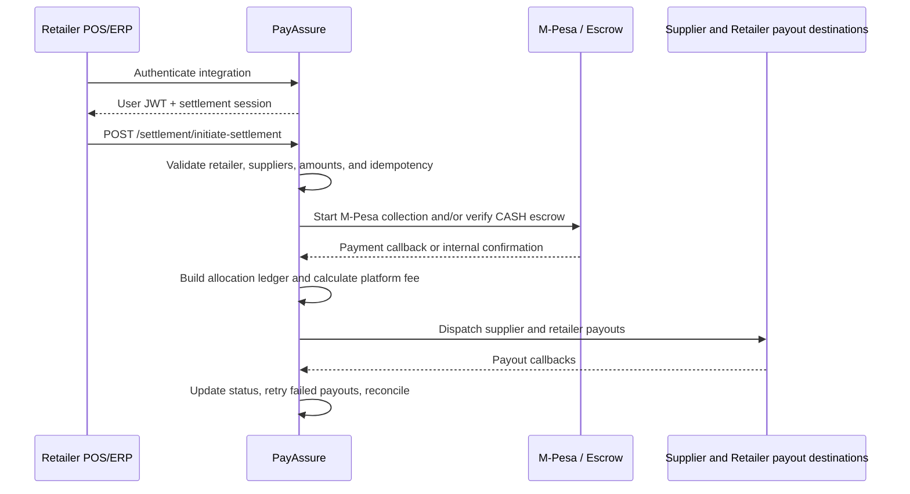

# Settlement Module

This is the authoritative documentation for the live settlement and supplier integration APIs implemented under `src/settlement/`.

The module coordinates retailer payment collection, escrow verification, supplier and retailer allocation, payout dispatch, callbacks, reconciliation, and retry tracking. PayAssure is settlement middleware; it does not act as a retailer POS, ERP, or inventory system.

## Route Prefixes

- `/settlement`: retailer authentication, initiation, payment confirmation, tracking, reconciliation, payout operations, and health checks.
- `/supplier`: supplier authentication, settlement lookup, and read-only mock retailer product lookup.

## Credentials And Headers

Credentials are separate and cannot be substituted for one another.

| Credential | Obtained from | Sent as | Used for |
| --- | --- | --- | --- |
| User access JWT | `POST /auth/login` or `/auth/refresh` | `Authorization: Bearer <jwt>` | Platform routes protected by `JwtAuthGuard`. |
| Retailer settlement session | `POST /settlement/authenticate` field `token` | `x-settlement-session: <token>` | Retailer settlement initiation. |
| Supplier session | `POST /supplier/authenticate` field `sessionToken` | `x-supplier-session: <token>` | Supplier settlement lookup. |
| Internal gateway token | `PAYMENT_GATEWAY_API_TOKEN`, `SETTLEMENT_API_TOKEN`, or `INTERNAL_GATEWAY_TOKEN` | `Authorization: Bearer <token>` | Internal payment confirmation. |
| Internal signature secret | `PAYMENT_GATEWAY_SIGNATURE_SECRET`, `SETTLEMENT_SIGNATURE_SECRET`, or `PAYASSURE_INTERNAL_SECRET` | HMAC for `x-payassure-signature` | Internal payment confirmation integrity. |

The retailer settlement session expires after 3600 seconds by default. Active sessions can be reused until they expire or are revoked; each valid use updates `lastUsedAt`. Older design notes that describe this token as one-time are stale.

## Recommended Flow



1. Retailer and supplier onboarding records and payout destinations are configured and verified.
2. Retailer obtains a platform JWT and authenticates its integration.
3. Retailer submits the canonical initiation payload.
4. PayAssure validates the retailer session, supplier eligibility, funding totals, allocation totals, currency, and duplicate reference.
5. M-Pesa collection and/or cash escrow verification runs.
6. A successful callback or internal payment confirmation moves the settlement into allocation and payout processing.
7. PayAssure dispatches payouts to verified supplier and retailer destinations.
8. Payout callbacks update idempotency records; failed payouts can be retried.
9. Reconciliation completes the settlement when bank confirmation is available.

## Retailer Authentication

### `POST /settlement/authenticate`

Requires a platform user JWT and the retailer integration credentials.

```http
Authorization: Bearer <user_access_token>
Content-Type: application/json
```

```json
{
  "apiKey": "pk_live_retailer123",
  "apiSecret": "sk_live_retailer789"
}
```

The response contains `token`, `expiresIn`, and retailer business details. The token is sent in `x-settlement-session` on the initiation request.

## Canonical Settlement Initiation

### `POST /settlement/initiate-settlement`

```http
Authorization: Bearer <user_access_token>
x-settlement-session: <retailer_session_token>
Content-Type: application/json
```

The retailer POS/ERP owns the commercial facts. It sends the supplier and retailer amounts; PayAssure does not need to become an inventory or pricing system.

### Final request shape

```json
{
  "merchantId": "pay_retailer_001",
  "merchantTransactionReference": "TXN-MIXED-20260916-000001",
  "amount": 127000,
  "currency": "KES",
  "payment": {
    "methods": [
      {
        "type": "CASH",
        "amount": 45000
      },
      {
        "type": "MPESA",
        "amount": 82000,
        "phoneNumber": "254791614036"
      }
    ]
  },
  "items": [
    {
      "supplierMerchantId": "pay_supplier_cement_001",
      "itemReference": "CEMENT-50KG-001",
      "supplierAmount": 38500,
      "retailerAmount": 3250
    },
    {
      "supplierMerchantId": "pay_supplier_steel_002",
      "itemReference": "STEEL-BAR-001",
      "supplierAmount": 32500,
      "retailerAmount": 2700
    },
    {
      "supplierMerchantId": "pay_supplier_electrical_003",
      "itemReference": "ELEC-CABLE-001",
      "supplierAmount": 26500,
      "retailerAmount": 2350
    },
    {
      "supplierMerchantId": "pay_supplier_plumbing_004",
      "itemReference": "PLUMB-PVC-001",
      "supplierAmount": 19500,
      "retailerAmount": 1700
    }
  ],
  "metadata": {
    "batchId": "BATCH-NAIROBI-20260916-001",
    "branchId": "NRB-WESTLANDS-001",
    "terminalId": "POS-WL-07",
    "salesAgentId": "agent-042",
    "invoiceReference": "INV-WL-20260916-00091"
  }
}
```

### Request rules

- `amount` must equal the sum of every item's `supplierAmount` and `retailerAmount`.
- Payment method amounts must equal `amount`.
- Supported customer funding methods are `CASH`, `MPESA`, and legacy methods supported by the existing DTO during migration.
- `phoneNumber` is required for an `MPESA` funding method.
- `supplierMerchantId` must resolve to an active supplier with a verified payout destination.
- `supplierAmount` and `retailerAmount` are supplied by the retailer system.
- `platformFee` must not be supplied by the client.
- `provider` must not be supplied by the client. PayAssure internally maps `CASH` to escrow and `MPESA` to the M-Pesa collection flow.
- `callbackUrl` and authoritative transaction timestamps are server-owned.
- `merchantTransactionReference` is unique per retailer and is the only initiation idempotency reference. Repeating it returns the existing settlement instead of creating a second one.
- `metadata` is optional but recommended for invoice, batch, branch, terminal, and audit context.
- Legacy fields such as `totalAmount`, `paymentMethod`, `paymentMethods`, `transactionDate`, and grouped `suppliers` remain supported during migration, but are not part of the final canonical payload.

### Platform fee calculation

Configure the fee on the server:

```env
PAYASSURE_PLATFORM_FEE_RATE=0.8
```

The value is a percentage. PayAssure calculates:

```text
commercialTotal = supplierAmount + retailerAmount
platformFee = commercialTotal * PAYASSURE_PLATFORM_FEE_RATE / 100
supplierDeduction = platformFee / 2
retailerDeduction = platformFee / 2
```

For KES 200 owed to the supplier and KES 200 retained by the retailer:

```text
platformFee = 400 * 0.8 / 100 = KES 3.20
supplier receives = 200 - 1.60 = KES 198.40
retailer receives = 200 - 1.60 = KES 198.40
PayAssure retains = KES 3.20
```

For the example payload above:

```text
commercial total: KES 127,000
supplier commercial allocation: KES 117,000
retailer commercial allocation: KES 10,000
platform fee at 0.8%: KES 1,016
supplier receives: KES 116,492
retailer receives: KES 9,492
PayAssure retains: KES 1,016
```

### Initiation response

The response returns the PayAssure settlement ID, generated reference, current status, amount, payment details, and child supplier settlement records. The server-generated `createdAt` is authoritative.

Duplicate initiation normally returns `200 OK` with the existing settlement.

## Payment Confirmation And Callbacks

### `POST /settlement/payment-callback`

Receives a provider callback identified by `merchantTransactionReference`. A successful callback advances the settlement to `PENDING_PROCESSING` and starts allocation/payout processing.

### `POST /settlement/payment-confirmation`

This internal route confirms payment from the payment gateway. It requires:

```http
Authorization: Bearer <PAYMENT_GATEWAY_API_TOKEN>
x-payassure-signature: <hmac_sha256_hex>
x-payassure-timestamp: <unix_seconds>
Content-Type: application/json
```

The signed fields are exactly:

```javascript
const signedBody = JSON.stringify({
  paymentId: body.paymentId,
  settlementId: body.settlementId,
  status: body.status,
  provider: body.provider,
  paidAmount: body.paidAmount,
  paidAt: body.paidAt,
});
```

The signature is an HMAC-SHA256 hex digest using the configured internal signature secret. The timestamp must be within five minutes of server time.

The compatibility alias `POST /settlement/internal/settlements/payment-confirmation` runs the same logic.

### M-Pesa callbacks

The payment module receives provider callbacks at `POST /payments/callbacks/mpesa`. When an M-Pesa callback succeeds, it updates the payment record and invokes the settlement allocation flow. `ResultCode: 0` represents a successful callback.

## Allocation And Payouts

### Allocation lifecycle

```text
INITIATED
  -> PENDING_PROCESSING
  -> PROCESSING
  -> PROCESSING_COMPLETE
  -> AWAITING_RECONCILIATION
  -> COMPLETED
```

Failure paths use `PROCESSING_FAILED` or `FAILED`.

### `POST /settlement/payouts/dispatch`

Dispatches a supplier or retailer payout after successful customer payment confirmation. Payout destinations are loaded from verified onboarding records; the customer payment phone number is never used as a payout destination.

### Payout idempotency and retry

The payout idempotency key is generated from:

```text
SHA256(settlementId + "::" + party + "::" + recipientMerchantId)
```

This guarantees one payout attempt per settlement, party, and recipient.

Default retry behavior:

- Maximum retries: `5`
- Initial delay: `60` seconds
- Exponential backoff multiplier: `2`
- Maximum delay: `3600` seconds
- Jitter: approximately plus or minus 10 percent
- Scheduler interval: `30` seconds
- Batch size: `10`

Payout statuses are `PENDING`, `SUBMITTED`, `COMPLETED`, `FAILED`, and `RETRYING`.

### Payout callback routes

- `POST /settlement/payouts/callback`
- `POST /settlement/payouts/callback/:callbackIdentifier`
- `POST /settlement/payouts/callback/:callbackIdentifier/callbacks/mpesa`

Successful provider statuses `SUCCESS` and `PAID` become `PAID` internally. The callback completes the payout idempotency record and updates the settlement allocation.

## Supplier APIs

### `POST /supplier/authenticate`

Authenticates a supplier integration using a platform JWT, API key, and API secret. It returns `sessionToken` for supplier lookup routes.

### `GET /supplier/settlements`

Requires `x-supplier-session` and returns settlement summaries allocated to the authenticated supplier.

### `GET /supplier/products/:supplierMerchantId`

Returns item-only data from the current mock retailer connections for a supplier.

### `GET /supplier/products/:supplierMerchantId/retailer/:retailerMerchantId`

Returns item-only data shared by one mock retailer and one supplier. These product routes are read-only side features and do not modify settlements, payments, inventory, or payment status.

## Tracking And Reconciliation

### `GET /settlement/track/:settlementId`

Returns current settlement status, amounts, customer payment details, supplier allocations, and transaction records. The controller defaults to the retailer view; supplier and PayAssure views are supported internally.

### `GET /settlement/transactions/:transactionId`

Returns transaction details for a settlement allocation.

### `GET /settlement/merchant/:merchantId`

Returns settlements for an integration merchant ID. Optional `from` and `to` query parameters filter `createdAt` using an inclusive lower bound and exclusive upper bound.

### `POST /settlement/reconcile`

Stores bank reconciliation data and marks the settlement as completed when the reconciliation succeeds.

## Operational And Debug Routes

These routes exist for monitoring or controlled operational use and should be protected at the API gateway before production exposure where no application guard is currently attached:

- `GET /settlement/health`
- `POST /settlement/split-and-payout/:merchantTransactionReference`
- `GET /settlement/payouts/retry-status/:settlementId`
- `GET /settlement/payouts/pending-retries`
- `POST /settlement/payouts/manual-retry/:settlementId`
- `POST /settlement/scenarios/run`

## Common Errors

| Code | Meaning |
| --- | --- |
| `INVALID_CREDENTIALS` | API key or secret is incorrect. |
| `INVALID_TOKEN` | Settlement session is missing or invalid. |
| `TOKEN_EXPIRED` | Settlement session has expired. |
| `SESSION_INACTIVE` | Settlement session is revoked or inactive. |
| `RETAILER_NOT_AUTHORIZED` | Session does not belong to an active retailer. |
| `VALIDATION_ERROR` | Payload or allocation validation failed. |
| `NO_ELIGIBLE_SUPPLIERS` | All supplier groups failed eligibility validation. |
| `PAYMENT_NOT_CONFIRMED` | Payout attempted before successful payment confirmation. |
| `SETTLEMENT_NOT_FOUND` | Settlement reference or ID could not be resolved. |
| `SUPPLIER_PAYMENT_NOT_FOUND` | Supplier payout destination is missing. |
| `RETAILER_PAYMENT_NOT_CONFIGURED` | Retailer payout destination is missing. |

## Source Of Truth

- Controllers: `src/settlement/settlement.controller.ts` and `src/settlement/supplier.controller.ts`
- Initiation and normalization: `src/settlement/operations/initiate.operation.ts`
- Validation: `src/settlement/helpers/validation.helpers.ts`
- Settlement workflow: `src/settlement/settlement.service.ts`
- Request DTOs: `src/settlement/dto/`
- Payout idempotency and retries: `src/settlement/services/`
- Database models: `prisma/schema.prisma`
- Swagger runtime route: `/api`
- Static API reference: `documentation/openapi.json`
